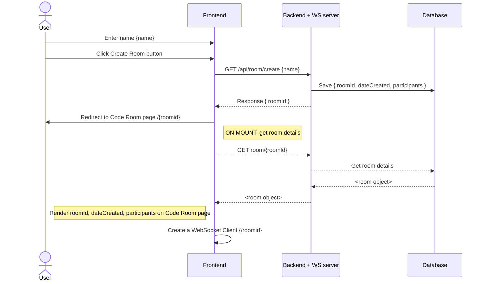
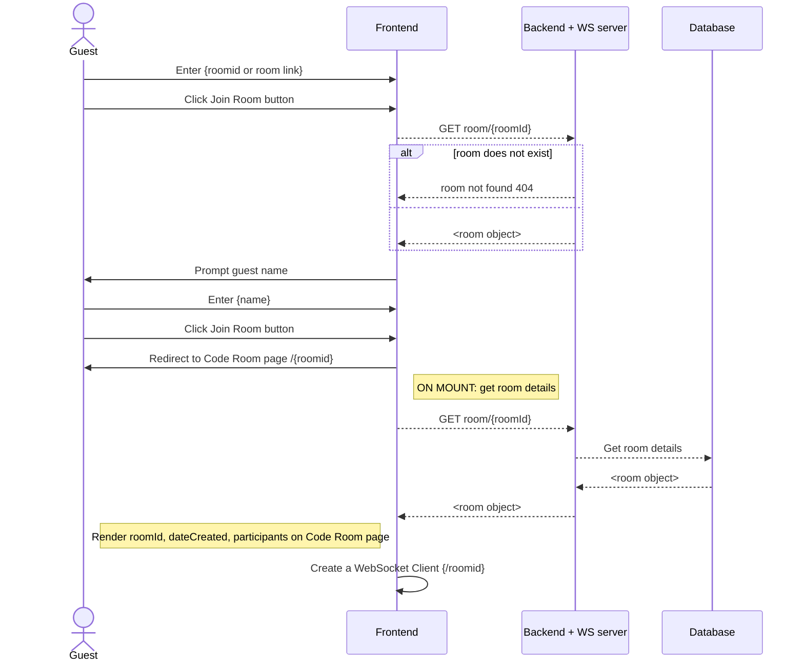

# Code Companion Server
Backend Server for Code Companion application built with NodeJS and Express.

## Prerequisites

- NodeJS (>=14.0.0)
- npm

## Installation
To install, simply execute the following command at the root of the repository

`npm i`

## Database setup

Create a `.env` file at the root of the repository, with your database credentials. 3 variables are required
- DB_HOST
- DB_USER
- DB_PASSWORD


## Build and Run

There are various modes to run the server

### For development purpose
`npm run start:nodemon`

### For production
`npm run start:prod`

## Build only
The output of the build will be under `./dist` directory. Following command can be used to build the project.

`npm run build`

#

## Summary

A web based code collaboration application that lets you create a code room, invite collaborators via a link and collaborate while coding in real time.

### DO list

- Optimize frontend
- Display all names on the web page which belong to that roomId

## Use Cases
- Coding Interviews
- Collaborative text editing/script writing
- Discussing programming related topics

## Features
1. Instantly create a code room without login
2. Invite others to discuss coding related topics
3. Code syntax highlight

# System Design

## DB Schema

```typescript
interface IRoom {
    roomId: string,
    owner: string,
    dateCreated: Date,
    participants: string[],
    programmingLanguage: string
}
```

## Sequence Diagram

### User creating a code room



### Guest entering a code room


